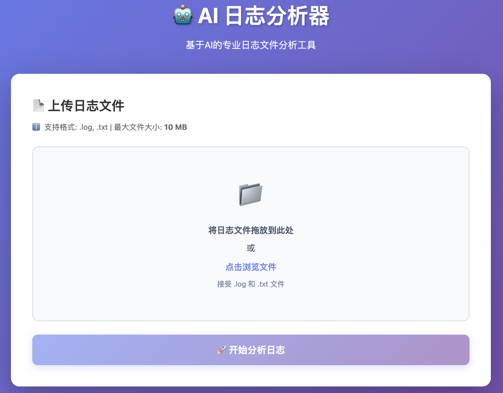
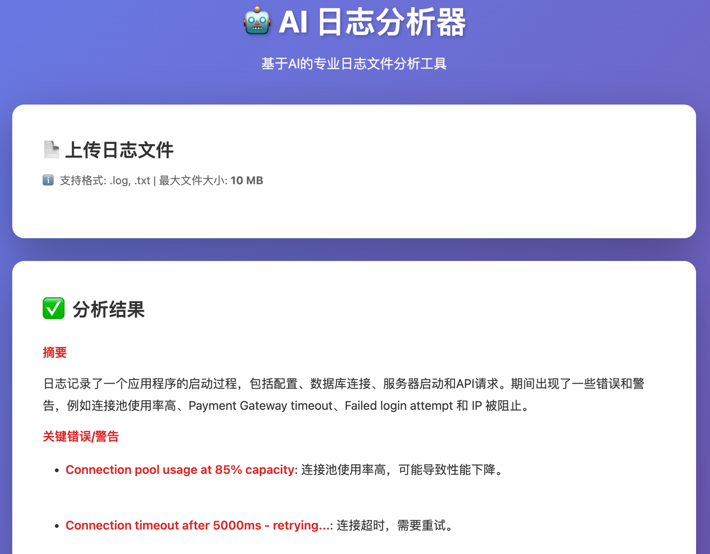

# AI Log Analyzer

一个由本地 Ollama 模型驱动的智能日志分析助手。上传您的日志文件，获取 AI 大模型的见解、错误检测和建议 - 完全本地运行，保护隐私。

## 功能特性

- **📤 上传日志**: 简洁的 Web 界面上传日志文件（最大 10MB）
- **🤖 AI 分析**: 由本地 Ollama 模型驱动
- **🎨 Markdown 渲染**: 输出格式优美，支持加粗、斜体、标题和列表
- **🔒 隐私优先**: 所有分析都在本地运行 - 您的日志永远不会离开您的机器
- **📊 结构化输出**: 获取摘要、关键问题、模式和建议
- **⚡ RESTful API**: 易于与其他工具集成
- **💾 零成本**: 100% 免费，无限使用

## 效果展示

<p align="center">
  
  
</p>

## 技术栈

- **后端**: Go 1.25+
- **AI**: Ollama（本地 LLM 运行时）

## 快速开始

### 1. 前置要求

- Go 1.25 或更高版本（项目基于 Go 1.25 构建）
- 已安装并运行 Ollama（[安装指南](https://ollama.ai)）

#### 安装 Ollama

```bash
# macOS / Linux
curl -fsSL https://ollama.ai/install.sh | sh

# 或从 https://ollama.ai/download 下载
```

#### 拉取模型

```bash
# 拉取推荐模型（llama3.2 - 更快更小）
ollama pull llama3.2

# 或尝试其他模型
ollama pull qwen2.5:7b  # 质量更好，速度稍慢
ollama pull mistral
ollama pull gemma2

# 列出可用模型
ollama list
```

### 2. 安装

```bash
# 克隆或下载项目
cd log-analyzer

# 安装依赖
go mod download
```

### 3. 配置

默认配置开箱即用。如需自定义，编辑 `.env`：

```bash
# 可选：更改 Ollama 端点（默认：http://localhost:11434/v1）
# OLLAMA_BASE_URL=http://localhost:11434/v1

# 可选：更改模型（默认：qwen2.5:7b）
# 推荐：llama3.2 以获得更快的处理速度
OLLAMA_MODEL=llama3.2

# 可选：API 超时时间（秒）（默认：600）
# 如果在 CPU 上运行或处理大型日志，请增加此值
# OLLAMA_TIMEOUT=600

# 可选：更改服务器端口（默认：8080）
# PORT=8080
```

### 4. 运行应用

```bash
# 直接运行（使用默认模型：qwen2.5:7b）
go run main.go

# 或指定模型
OLLAMA_MODEL=llama3.2 go run main.go

# 或编译后运行
go build -o log-analyzer
./log-analyzer
```

服务器将在 `http://localhost:8080` 启动

### 5. 使用方法

#### Web 界面

1. 在浏览器中打开 `http://localhost:8080`
2. 点击"选择文件"并选择一个日志文件（或使用 `sample.log`）
3. 点击"分析日志"
4. 等待分析完成（CPU 上可能需要 3-5 分钟）
5. 查看 AI 生成的分析结果：
   - **粗体文本**标识重要问题
   - 标题用于章节组织
   - 列表展示结构化信息
   - 代码块显示日志片段

#### API 端点

```bash
curl -X POST http://localhost:8080/analyze \
  -F "logfile=@/path/to/your/logfile.log"
```

响应：
```json
{
  "analysis": "摘要：日志显示应用程序启动和 API 请求...\n\n关键问题：\n1. 多个 404 错误..."
}
```

## API 端点

- `GET /` - Web 界面主页
- `POST /analyze` - 上传并分析日志文件
  - 表单字段：`logfile`（multipart/form-data）
  - 最大大小：10MB
  - 返回：JSON 格式的分析结果
- `GET /health` - 健康检查端点

## 支持的日志格式

当前接受任何基于文本的日志文件：
- `.log` 文件
- `.txt` 文件
- 任何纯文本格式

## 限制

- 最大文件大小：10MB
- 日志内容截断至约 3,000 字符（针对 CPU 性能优化）
- 仅支持单文件上传
- 处理时间：CPU 上 3-5 分钟，GPU 上 10-30 秒
- 输出限制为 1,000 tokens，以加快生成速度

## 使用 Ollama 的优势

- **100% 免费**：无 API 费用，无限使用
- **完全隐私**：您的日志永远不会离开您的机器
- **无需互联网**：完全离线工作
- **可定制**：从数十个开源模型中选择
- **快速（使用 GPU）**：配备适当硬件可实现近实时分析

### 硬件建议

- **最低配置**：8GB RAM，CPU（慢但可用）
- **推荐配置**：16GB RAM，Apple Silicon 或 NVIDIA GPU
- **最佳配置**：32GB+ RAM，配备 8GB+ VRAM 的独立 GPU

## 📚 文档

本项目包含全面的文档，帮助您理解和维护代码库：

## 🔄 与 AI 助手协作

本项目设计用于与 Claude Code 等 AI 编码助手无缝协作：

## 版本历史

- **v1.0.0** (2026-03-119) - MVP 发布
  - ✅ 本地 Ollama 集成
  - ✅ Markdown 渲染
  - ✅ llama3.2 模型支持


## 许可证

MIT License - 可自由使用和修改。

---


